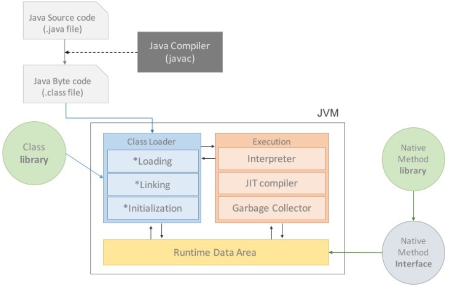

## Java  
*  객체 지향 프로그래밍 언어  
*  운영체제에 독립적  
*  Garbage Collection  
   * 자동적으로 메모리를 관리해주는 프로그램
*  네트워크와 분산처리를 지원함
*  multi-thread 지원
*  dynamic loading (동적 로딩 사용)  
   * 프로그램 실행 시 모든 클래스가 로딩되지 않고, 필요한 시점에 클래스를 로딩하여 사용하는 기능
   * 애플리케이션 변경 사항이 발생해도 비교적 적은 작업만으로 처리 가능함
   * byte code를 하드웨어의 기계어로 바로 변환해주는 JIT Compiler 와 Hotspot같은 신기술 도입으로 JVM 성능 향상와 속도 문제가 개선되었음
*  Java 버전 
    * oracle, sun 자바의 경우에는 다른 문서를 봐야
    * openjdk 1.8 : https://devdocs.io/openjdk~8/

* 컴파일 절차
    * .java 작성 --(javac.exe: 컴파일러)--> .class 생성 --(java.exe: 인터프리터   )--> 실행 

## JVM (Java virtual machine)

#### 이미지 참조-> https://doozi0316.tistory.com/entry/1%EC%A3%BC%EC%B0%A8-JVM%EC%9D%80-%EB%AC%B4%EC%97%87%EC%9D%B4%EB%A9%B0-%EC%9E%90%EB%B0%94-%EC%BD%94%EB%93%9C%EB%8A%94-%EC%96%B4%EB%96%BB%EA%B2%8C-%EC%8B%A4%ED%96%89%ED%95%98%EB%8A%94-%EA%B2%83%EC%9D%B8%EA%B0%80
* 일반 애플리케이션의 경우 OS를 거쳐 하드웨어를 제어하게 되는데, Java는 jvm을 통해 기계어로 번역되어 전달됨
* 따라서 일반 Java 코드는 JVM을 한번 더 거치기 때문에, 완전히 하드웨어에 맞게 컴파일 된 상태가 아님 -> 속도 이슈로 이어짐
* 바이트 코드(컴파일된 자바 코드)를 하드웨어의 기계어로 바로 변환해주는 JIT 컴파일러와 향상된 최적화 기술이 적용되어 속도 이슈가 많이 줄음
* 그러나 JVM의 경우 OS에 종속적이므로 별도 버전의 설치가 필요함

## Java의 정석 공부방법
* 열심히 한다.
* 객체지향
* 책에서 설명하는 특정 클래스는 많이 써보자
* thread
* lambda, stream
* input stream, output stream
* Network Programming은 여러번 해보자